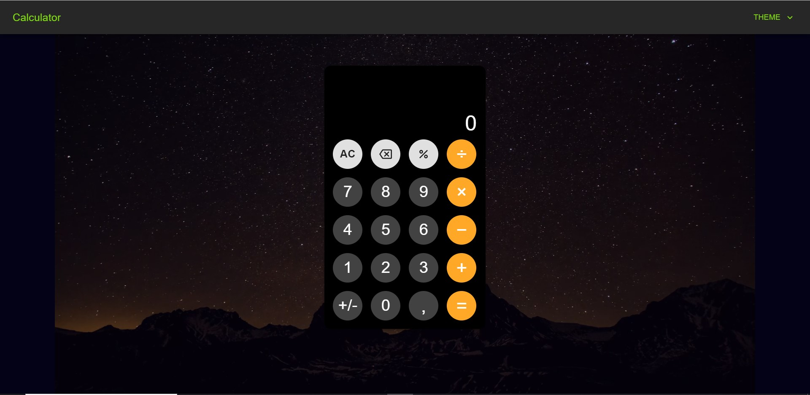
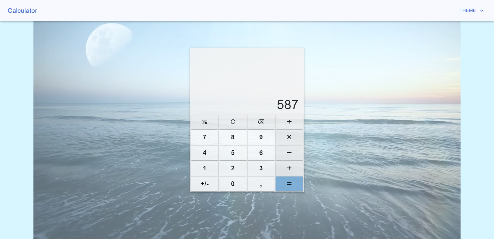
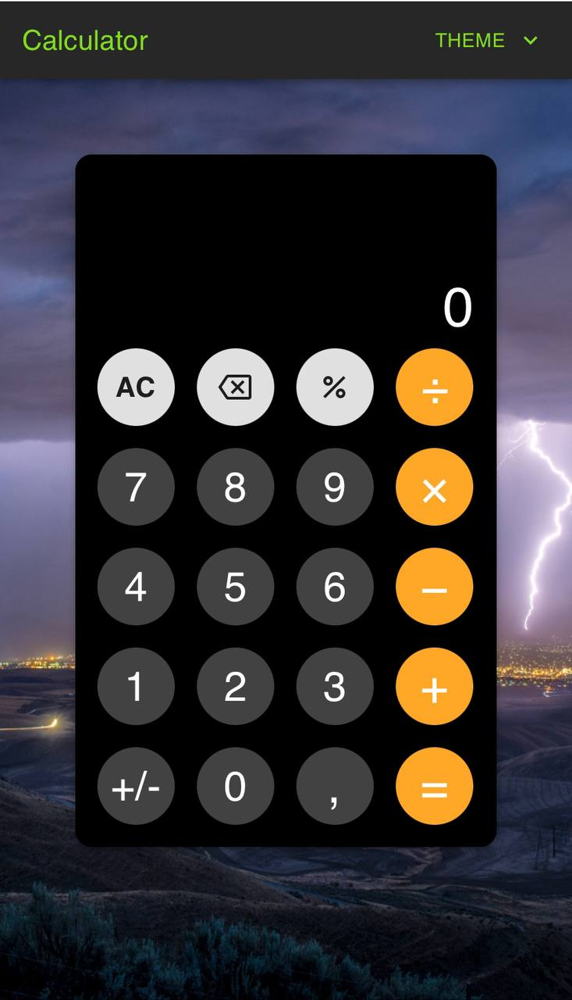
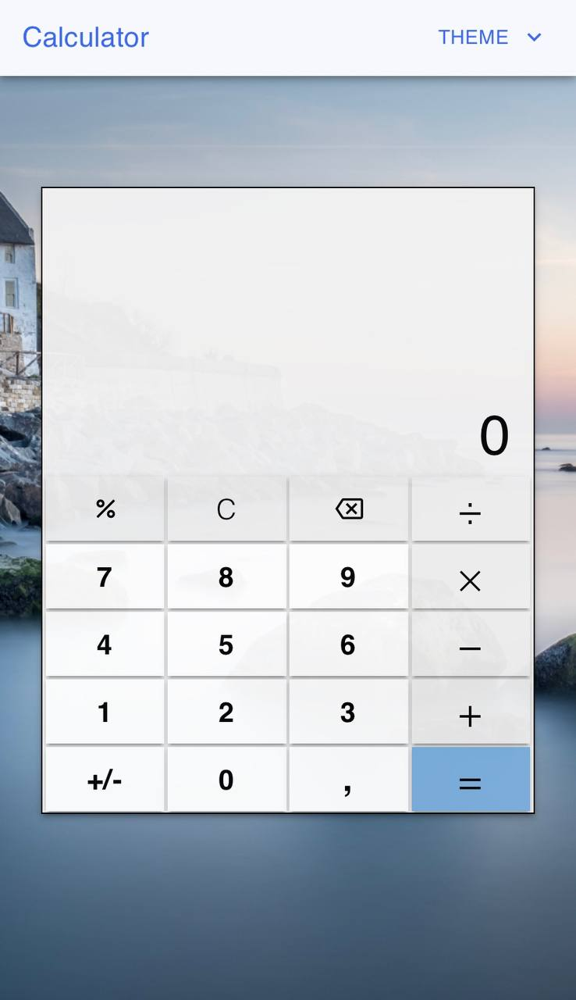

# Calculator

> This project uses React.js and has two looks: Light (like Windows calculator) and Dark (inspired by iPhone). It's easy to use, with different backgrounds for computers (videos) and mobiles (pictures).
> 
> You can find the final version of the application [_here_](https://calculator-alex7.netlify.app).

## Table of Contents
* [Usage Guide](#usage-guide)
* [Features](#features)
* [Technologies Used](#technologies-used)
* [Screenshots](#screenshots)

## Usage Guide
1. Clone the project <br>```git clone https://github.com/alexonthespot7/calculator.git```<br>
2. run the following command in a terminal window (in the complete) directory:<br>
```npm install```<br>
3. run the following command in a terminal window (in the complete) directory:<br>
```npm start```<br>
4. Navigate to localhost:3000

## Features
- Dual Themes: Choose between a Light theme, reminiscent of Windows calculator, and a Dark theme inspired by the iPhone calculator.

- User-Friendly Interface: The calculator is designed to be easy to use, ensuring a straightforward and intuitive experience.

- Responsive Design: Enjoy a consistent experience across devices, with dynamic backgrounds – videos for computers and images for mobiles.

- Versatile Backgrounds: Backgrounds adapt to the device, providing an immersive environment with videos on computers and personalized images on mobile devices.

## Technologies Used
- React.js
- css

## Screenshots
<p align="center">
  
  
   &nbsp;&nbsp;&nbsp;&nbsp;&nbsp;&nbsp;&nbsp;&nbsp; 
</p>
